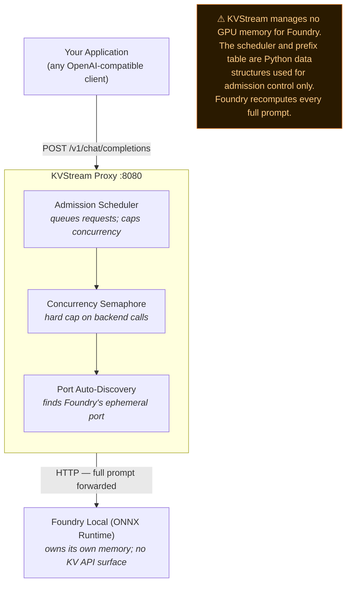

# KVStream

**KVStream is an OpenAI-compatible proxy that puts an admission-control queue in front of [Microsoft Foundry Local](https://learn.microsoft.com/azure/ai-foundry/foundry-local/), so a burst of client queries drains through safely instead of overwhelming the runtime.**

It auto-discovers Foundry Local's shifting port, caps how many requests hit the runtime at once, and queues the rest — no model changes, no backend configuration.

> **Scope — read this first.** KVStream operates at the HTTP proxy layer. For Foundry Local it does **not** own the runtime's memory or KV tensors, and it does **not** make individual tokens generate faster. What it does is stop the runtime from being flooded: it admits requests at a safe concurrency and queues the overflow, so more submitted queries *complete* instead of timing out or erroring. See [What KVStream does for Foundry Local](#what-kvstream-does-for-foundry-local) for the honest, per-feature breakdown.

[](https://github.com/microsoft/KVstream/actions/workflows/ci.yml)
[](LICENSE)
[](https://www.python.org/downloads/)
[](https://pypi.org/project/kvstream/)

> **Focus:** KVStream is developed and supported for **Foundry Local only**. The codebase still contains adapters for other runtimes (Ollama, llama.cpp, LM Studio), but they are unsupported and outside the scope of this documentation — see [Backend support](#backend-support).

---

## Why put KVStream in front of Foundry Local?

Foundry Local runs models locally on the ONNX Runtime. Like most local runtimes, when several clients call it at the same time it accepts every request at once — and past its optimal concurrency, latency spikes and some requests time out or fail.

KVStream sits in front as a **transparent, OpenAI-compatible proxy on `:8080`** and acts as an **admission-control gate**:

- Only `max_batch_size` requests (default **8**) are allowed to reach Foundry Local at any moment.
- Additional requests **queue** and are admitted the instant a slot frees.
- If the queue itself fills up, callers get a clean `503 — retry later` instead of a hung connection.

The practical effect: your application can fire many concurrent queries at KVStream and, up to the queue depth, they drain through in order (under the default FCFS policy) instead of a thundering herd degrading the runtime; requests beyond the queue cap get a clean `503`. This is throughput *stabilisation*, not token-level acceleration.

It also removes a real Foundry Local papercut: **Foundry Local assigns a new port on almost every restart.** KVStream auto-discovers the active port for you (see below), so you never have to chase it.

---

## What KVStream does for Foundry Local

Because Foundry Local runs on the ONNX Runtime and exposes no KV-cache API, KVStream operates in **soft mode** for it. Here is the honest breakdown of what is and is not active:

| Capability | Active for Foundry Local? | Notes |
|---|---|---|
| **Admission control** | ✅ Yes | Never more than `max_batch_size` concurrent calls reach the runtime. Enforced by a hard semaphore, independent of internal bookkeeping. |
| **Request queuing (continuous admission)** | ✅ Yes | Waiting requests are admitted individually the moment a running one frees a slot — not held for a fixed batch boundary. KVStream does **not** merge requests; each is a separate backend call. |
| **Backpressure** | ✅ Yes | Queue depth is capped (`max_queue_depth`, default 1000); overflow returns `503`. |
| **Ephemeral-port auto-discovery** | ✅ Yes | Scans localhost, probes `/v1/models`, and locks onto the port with a model loaded — survives Foundry restarts. |
| **Streaming passthrough** | ✅ Yes | Server-Sent Events are parsed and re-emitted; handles Foundry's empty-`stop` HTTP 400 quirk. |
| **Live status / CLI dashboard** | ✅ Yes | `/status` and `kvstream status --watch` show queue depth, running count, and accounting stats. |
| **Prometheus `/metrics` endpoint** | ⚠️ Endpoint only | The route exists but currently exports only the client library's default process/runtime metrics — **no KVStream-specific series** (queue depth, batch size, etc.) are registered yet. |
| **GPU KV tensor pool (PagedAttention)** | ❌ No | Not allocated for Foundry — the ONNX runtime owns its own memory. `--gpu-blocks` is only a logical queue-accounting number, **not VRAM**. |
| **Preemption / swap** | ❌ No | KVStream cannot pause an in-flight ONNX stream, so running requests are never evicted — the overflow simply stays queued. |
| **Prefix cache recompute savings** | ❌ No | KVStream cannot inject KV state into ONNX. The prefix hash table still runs, but Foundry **recomputes the full prompt every time** — there is no GPU-level reuse. |

> **The bottom line for Foundry Local:** the value is *admission control + concurrency governance + zero-config port discovery*. Claims about paged KV memory, KV reuse, or faster tokens do **not** apply.

---

## What is scaffolding, on every backend

KVStream is an HTTP proxy. It talks to runtimes over their REST APIs and receives **text tokens over Server-Sent Events** — it never loads model weights, never runs a forward pass, and never sees the K/V tensors the backend computes inside its own process. Because of that boundary, several modules in the codebase are **present but not on any active execution path, for any backend** (not just Foundry):

- **`PagedKVCache` (the paged "KV tensor pool")** — allocated only for llama.cpp, and even there it is **never written to or read from**. Its `write_kv` / `gather` / `copy_blocks` methods have no call sites. For Foundry / Ollama / LM Studio it is not allocated at all.
- **The paged-attention kernels** (`naive` / `flash` / `xformers`) — never invoked. KVStream runs no attention computation, so it cannot make tokens generate faster; token speed is entirely the backend's.
- **Hard KV inject** (`save_kv_state` / `restore_kv_state`) — implemented on the llama.cpp adapter but **never called** by the engine or scheduler.

These are vestiges of a different architecture — one where KVStream would *host* the model and run PagedAttention itself (like vLLM). In the shipped proxy design that code cannot execute. **The `BlockManager`'s "pages" are an abstract capacity counter used to gate admission — they hold no KV data.** If you are evaluating KVStream, judge it on what actually runs: admission control, request queuing, backpressure, port auto-discovery, streaming passthrough, and observability.

---

## Architecture



### Request lifecycle

1. A request arrives at the proxy and is **queued by the admission scheduler**. It is admitted only when a concurrency slot is free — so Foundry Local is never flooded.
2. On admission, a concurrency semaphore slot is taken and the full prompt is forwarded to Foundry Local over HTTP. (Virtual pages are tracked for accounting only — no KV tensors are written.)
3. Tokens stream back from Foundry via Server-Sent Events and are re-emitted to your client unchanged.
4. When the request finishes, its slot is released and the next queued request is admitted on the scheduler's next tick (10 ms under load, 100 ms when idle).

---

## Quick Start

### 1. Start Foundry Local

```bash
# Install and run a model with the Foundry Local CLI
foundry model run qwen2.5-0.5b-instruct-generic-cpu
```

Foundry Local will start its local service on an OS-assigned port. **You do not need to know the port** — KVStream will find it.

### 2. Install KVStream

```bash
pip install kvstream
```

Or from a clone (for development):

```bash
git clone https://github.com/microsoft/kvstream
cd kvstream
pip install -e .

# Reproducible install with fully pinned versions (CI / production):
#   pip install -r requirements.txt && pip install -e . --no-deps
```

### 3. Start the proxy

`serve` already defaults to the Foundry Local backend:

```bash
# Auto-discovers Foundry Local's port; serves the proxy on :8080
kvstream serve --backend foundry --port 8080 --max-batch 8

# Override the model if needed (must match an id from /v1/models)
kvstream serve --backend foundry --model qwen2.5-0.5b-instruct-generic-cpu
```

### 4. Point your app at KVStream

```bash
curl http://localhost:8080/v1/chat/completions \
  -H "Content-Type: application/json" \
  -d '{
    "model": "qwen2.5-0.5b-instruct-generic-cpu",
    "messages": [{"role": "user", "content": "Hello!"}],
    "stream": true
  }'
```

Drop-in replacement for the OpenAI Python client:

```python
import openai
client = openai.AsyncOpenAI(base_url="http://localhost:8080/v1", api_key="none")
```

### Python library

```python
import asyncio
from kvstream import KVStreamEngine
from kvstream.backends import FoundryBackend

engine = KVStreamEngine(
    backend=FoundryBackend(model="qwen2.5-0.5b-instruct-generic-cpu"),
    max_batch_size=8,        # max concurrent requests reaching Foundry Local
)

# Serve as an OpenAI-compatible proxy
asyncio.run(engine.serve(port=8080))
```

---

## How the port auto-discovery works

Foundry Local's port changes between restarts, which makes a fixed `base_url` unreliable. [`FoundryBackend`](kvstream/backends/foundry.py) handles this automatically:

1. **Cached URL** — reuses the last known-good URL if it still responds.
2. **Configured URL** — tries `base_url` (default `http://localhost:5273`).
3. **Port scan** — probes every listening localhost port for an OpenAI-compatible `/v1/models` response and **prefers the port that actually has a model loaded**.
4. **Fallback** — returns the configured URL if nothing is found.

Discovery is serialised behind a lock (so a burst of requests triggers only one scan) with a 5-second cooldown when Foundry is not running, and the KVStream proxy's own port is excluded so it never mistakes itself for the backend. It only ever scans localhost and never makes outbound connections.

---

## Configuration

`kvstream.yaml` in the working directory (or pass `--config path/to/file.yaml`):

```yaml
backend:
  type: foundry
  base_url: http://localhost:5273               # starting guess; auto-discovered if wrong
  model: qwen2.5-0.5b-instruct-generic-cpu      # model id returned by /v1/models
  timeout_seconds: 120.0

scheduler:
  max_batch_size: 8            # max concurrent requests reaching Foundry Local
  priority: fcfs               # fcfs (first-come) | sjf (shortest-job-first)
  admission_timeout_seconds: 120.0   # how long a request may queue before rejection
  max_queue_depth: 1000        # queue cap; overflow returns HTTP 503

prefix_cache:
  enabled: false               # recommended off for Foundry — no recompute savings, pure overhead

# NOTE: the `memory:` block below configures a LOGICAL page counter used as a
# secondary admission gate — it is NOT real VRAM for Foundry Local.
memory:
  num_gpu_blocks: 256          # concurrency-accounting units for Foundry (not VRAM)
  block_size: 16               # power of two
```

Some config fields have no effect on the Foundry path (`scheduler.max_waiting_tokens`, `scheduler.max_tokens_per_seq`, `scheduler.preemption_policy`, `memory.num_cpu_blocks`/`dtype`, and the `attention:` block) — see the integration guide's [configuration reference](docs/integration-guide.md#6-configuration-reference).

Every field is also settable as an environment variable: `KVSTREAM_BACKEND__TYPE=foundry`, `KVSTREAM_SCHEDULER__MAX_BATCH_SIZE=16`, etc. CLI flags override YAML, which overrides env vars, which override built-in defaults.

---

## Benchmarks

KVStream ships a built-in load generator so you can measure the admission-control
effect **on your own hardware** — numbers vary with model, quantisation, CPU/GPU,
and prompt mix, so no fixed table is published.

```bash
# 1. Baseline: point bench directly at Foundry Local's port
kvstream bench --url http://localhost:<foundry-port> --concurrency 16 --total-requests 50

# 2. With KVStream in front
kvstream serve --backend foundry --port 8080
kvstream bench --url http://localhost:8080 --concurrency 16 --total-requests 50
```

Compare **p50/p99 latency and the error count** between the two runs. The expected
win is that the KVStream run completes all requests with fewer/no errors, because it
admits them at Foundry's safe concurrency and queues the rest — rather than letting
16 simultaneous requests degrade a runtime that is happiest around its optimal batch.

> **Context length matters.** The default bench parameters (`--prompt-len 128
> --output-len 64`) use short contexts. At realistic agent or RAG workloads
> (10k–100k tokens) pre-fill cost dominates and admission-control gains shrink.
> Always benchmark at the context lengths your workload actually uses.

---

## Observability

The real observability surface is `/status` and the CLI dashboard:

```bash
# Live CLI dashboard (waiting / running / queue depth)
kvstream status --watch

# Health + which Foundry port was discovered
curl http://localhost:8080/health

# Scheduler + queue snapshot
curl http://localhost:8080/status | jq
```

A `/metrics` endpoint exists for Prometheus, but it currently exports only the
`prometheus_client` library's default process/runtime metrics — **no KVStream
series are registered yet**, so scraping it tells you nothing about queue depth or
concurrency. The bundled `docker compose --profile metrics` Prometheus/Grafana
stack is wired to the Compose **Ollama** backend, not Foundry Local, so it does not
apply to a host-run Foundry setup as shipped.

---

## Backend support

KVStream targets **Foundry Local only**. Everything documented here — admission control, request queuing, backpressure, and ephemeral-port auto-discovery — applies to the Foundry Local path in *soft mode*: KVStream queues requests and enforces a maximum concurrency, and Foundry Local (ONNX Runtime) receives and recomputes the full prompt on every request. No KV tensors are shared or transferred.

The repository still contains adapters for Ollama, llama.cpp, and LM Studio, and a `--backend` flag that can select them. **These are unsupported and untested against this documentation.** Their inference-oriented features (paged KV memory, hard KV inject, preemption) are inert on every path — see [What is scaffolding](#what-is-scaffolding-on-every-backend). If you only need Foundry Local, ignore them.

---

## Security Considerations

KVStream is designed to run as a **trusted, local inference proxy**. Review the
following before deploying it anywhere beyond `localhost`:

- **No built-in authentication.** None of the HTTP endpoints (`/v1/chat/completions`,
  `/status`, `/metrics`, `/health`) require credentials. The server binds to
  `127.0.0.1` by default. Do **not** bind to `0.0.0.0` or publish the port on an
  untrusted network without an authenticating reverse proxy (nginx, Caddy, or an
  API gateway) in front of it.
- **`docker compose` publishes port 8080.** Restrict access with host firewall
  rules or a reverse proxy if the host is reachable by others.
- **`/status` and `/health` disclose operational data** (queue depth, running
  count, model name). Treat them as internal.
- **The Foundry Local backend discovers the runtime by probing localhost ports.**
  It only scans the local machine and never makes outbound connections.
- **Grafana / Prometheus (`--profile metrics`) are for local development.** Set a
  strong password (`KVSTREAM_GRAFANA_PASSWORD`) before exposing the dashboard.
- Report security issues per [SECURITY.md](SECURITY.md) — do not open public issues
  for vulnerabilities.

---

## Contributing

See [CONTRIBUTING.md](CONTRIBUTING.md). We welcome backend adapters, benchmarks on new hardware, and documentation improvements.

## License

[Apache 2.0](LICENSE) — use freely in commercial and private deployments.
