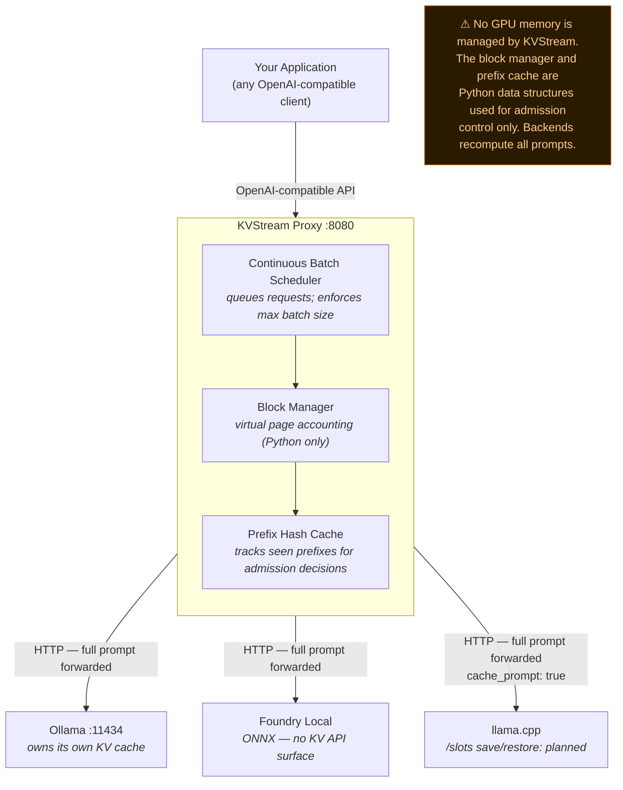

# KVStream

**KVStream is an OpenAI-compatible proxy that sits in front of your existing LLM runtime and adds admission-control queuing, a continuous-batch scheduler, and a Python-level prefix hash cache — without modifying the backend or the model.**

Works with Ollama, Foundry Local, llama.cpp, and LM Studio — no model changes required.

> **Scope:** KVStream operates at the HTTP proxy layer. It does not own the backend's GPU memory or KV tensors. The real benefit is preventing runtime overload through admission control and batch-size enforcement. See [Supported Backends](#supported-backends) for an honest per-backend breakdown.

[](https://github.com/microsoft/KVstream/actions/workflows/ci.yml)
[](LICENSE)
[](https://www.python.org/downloads/)
[](https://pypi.org/project/kvstream/)

---

## Why KVStream?

When multiple clients hit a local LLM runtime simultaneously, the runtime accepts every request at once, degrades under load, and some requests time out or OOM. KVStream solves this by acting as an **admission-control gate** in front of the runtime.

KVStream sits in front of your existing runtime as a **transparent OpenAI-compatible proxy** and provides:

| Feature | What it does | Applies to |
|---|---|---|
| **Admission-control scheduler** | Queues requests; admits only when a batch slot is free — backend is never flooded | All backends |
| **Continuous batching** | Requests join the batch the moment a slot frees, not at the next full-batch boundary | All backends |
| **Prefix hash cache** | Tracks shared prompt prefixes in a Python hash table; avoids re-allocating admission pages for duplicate prefixes | All backends (see note) |
| **Virtual page accounting** | Per-sequence page table used for admission decisions and preemption ordering | All backends |
| **Swap & preemption** | Low-priority sequences re-queued rather than dropped when the batch is full | All backends (accounting only for soft backends) |

> **What KVStream does NOT do for Ollama / Foundry Local / LM Studio:** it cannot access or modify the backend's GPU memory. The page table is logical accounting only — the backend still receives and recomputes every full prompt on every request. No KV tensors are shared at the GPU level. The measurable gain is purely from admission control: preventing the runtime from being overwhelmed beyond its optimal concurrency.

> **llama.cpp:** the `save_kv_state` / `restore_kv_state` methods are implemented in the backend adapter but are **not yet wired into the scheduler**. The current llama.cpp path sends `cache_prompt: true` and relies on llama.cpp's own internal caching.

How much admission-control batching helps depends on your concurrency pattern and model — measure it on your own hardware with `kvstream bench` (see [Benchmarks](#benchmarks)).

---

## Architecture



### Request lifecycle

1. A request arrives and is **queued by the continuous-batch scheduler** — it is admitted only when a batch slot and KV pages are available, so the backend runtime is never overloaded.
2. On admission, KV pages are allocated for the prompt; from then on the page table **grows one slot per generated token** (streaming allocation) instead of reserving `max_tokens` upfront.
3. If the prompt shares a prefix with an earlier request, KVStream records the match in its Python prefix hash table and skips re-allocating admission pages. The backend still receives and recomputes the full prompt — GPU-level prefix reuse depends on the backend's own caching (e.g. llama.cpp's `cache_prompt`).
4. When the request finishes, its prefix hash is registered for future matching and its virtual pages return to the pool — the next queued request joins the batch on the scheduler's next tick (10 ms).

> **Soft vs hard KV inject:** for Ollama, Foundry Local, and LM Studio the runtime owns its internal KV tensors and KVStream cannot access them — the page pool provides *admission and concurrency accounting* only (soft mode). llama.cpp exposes a `/slots` API that could allow binary KV state save/restore (hard mode), but this is **not yet wired into the scheduler**. The current llama.cpp path relies on llama.cpp's own `cache_prompt` flag. See [Supported Backends](#supported-backends).

---

## Quick Start

KVStream is available on [PyPI](https://pypi.org/project/kvstream/) and can be installed with:

```bash
pip install kvstream
```

### Option 1 — Docker (recommended, zero Python setup)

```bash
git clone https://github.com/microsoft/kvstream
cd kvstream

# Start with Ollama (default) — pulls llama3.2 automatically
docker compose up -d

# Your app now talks to KVStream on :8080
curl http://localhost:8080/v1/chat/completions \
  -H "Content-Type: application/json" \
  -d '{
    "model": "llama3.2",
    "messages": [{"role": "user", "content": "Hello!"}],
    "stream": true
  }'
```

Switch backends via env var:
```bash
KVSTREAM_BACKEND=llamacpp KVSTREAM_BACKEND_URL=http://localhost:8080 docker compose up -d
KVSTREAM_BACKEND=foundry  KVSTREAM_BACKEND_URL=http://localhost:5273 docker compose up -d
KVSTREAM_BACKEND=lmstudio KVSTREAM_BACKEND_URL=http://localhost:1234 docker compose up -d
```

### Option 2 — CLI

```bash
# From a clone of this repo (a PyPI release is planned):
pip install -e .

# Reproducible install with fully pinned versions (CI / production):
#   pip install -r requirements.txt && pip install -e . --no-deps

# Auto-detect Ollama and start proxy on :8080
kvstream serve --backend ollama --port 8080 --gpu-blocks 2048

# With llama.cpp — run llama-server on :8081 so it doesn't clash with the
# proxy's :8080 (admission control + llama.cpp's own cache_prompt caching)
kvstream serve --backend llamacpp --backend-url http://localhost:8081 --port 8080

# Monitor live stats
kvstream status --watch

# Run a throughput benchmark
kvstream bench --concurrency 16 --prompt-len 512 --output-len 128
```

### Option 3 — Python library

```bash
# From a clone of this repo (a PyPI release is planned):
pip install -e .
```

```python
import asyncio
from kvstream import KVStreamEngine
from kvstream.backends import OllamaBackend

engine = KVStreamEngine(
    backend=OllamaBackend(base_url="http://localhost:11434", model="llama3.2"),
    num_gpu_blocks=2048,   # controls max queued sequences (not real VRAM for Ollama)
    block_size=16,
    max_batch_size=16,
)

# Use as an async generator
async def main():
    async for token in engine.generate("Explain quantum entanglement simply:"):
        print(token.text, end="", flush=True)

asyncio.run(main())

# Or serve as an OpenAI-compatible proxy
asyncio.run(engine.serve(port=8080))
```

Drop-in replacement for the OpenAI Python client — point it at KVStream:
```python
import openai
client = openai.AsyncOpenAI(base_url="http://localhost:8080/v1", api_key="none")
```

---

## Configuration

`kvstream.yaml` (place in working directory, or pass `--config path/to/file.yaml`):

```yaml
backend:
  type: ollama                   # ollama | foundry | llamacpp | lmstudio
  base_url: http://localhost:11434
  model: llama3.2

memory:
  num_gpu_blocks: 2048           # each page = block_size × heads × head_dim × 2 × dtype_bytes
  num_cpu_blocks: 8192           # swap buffer — larger = safer under preemption
  block_size: 16                 # tokens per page (power of two: 8 / 16 / 32)
  dtype: float16

scheduler:
  max_batch_size: 16
  preemption_policy: swap        # swap (pages to CPU) | recompute (drop & redo)
  priority: fcfs                 # fcfs | sjf

prefix_cache:
  enabled: true
  max_prefix_length: 2048        # tokens
  ttl_seconds: 3600

attention:
  backend: naive                 # naive (reference); flash/xformers are roadmap
```

All fields also settable as environment variables: `KVSTREAM_BACKEND__TYPE=llamacpp`, `KVSTREAM_MEMORY__NUM_GPU_BLOCKS=4096`, etc.

---

## Supported Backends

| Backend | Status | KV mode | What KVStream actually provides |
|---|---|---|---|
| **Ollama** | ✅ Stable | Soft | Admission control, request queuing, prefix hash tracking. Backend owns its own KV cache. |
| **Foundry Local** | ✅ Stable | Soft | Admission control, request queuing. HTTP passthrough only — ONNX runtime; no KV API surface. |
| **llama.cpp server** | ✅ Stable | Soft (hard: planned) | Admission control + sends `cache_prompt: true`. The `/slots` save/restore adapter exists but is not yet called by the scheduler. |
| **LM Studio** | 🔶 Beta | Soft | Admission control, request queuing. HTTP passthrough only — no KV API surface. |

**Soft mode (all backends):** KVStream queues requests and enforces a maximum batch size. The backend receives and recomputes the full prompt on every request. No KV tensors are shared or transferred at the GPU level.

**Hard mode (llama.cpp — not yet active):** the `LlamaCppBackend` implements `save_kv_state` / `restore_kv_state` against the `/slots` API, but the scheduler does not yet call these methods. The backend currently benefits only from llama.cpp's own `cache_prompt` caching. Full KVStream-managed slot save/restore is a planned feature.

---

## Benchmarks

KVStream ships with a built-in load generator so you can validate the
concurrency claim **on your own hardware** — numbers vary with GPU, model,
quantisation, and prompt mix, so we don't publish a fixed table.

```bash
# 1. Baseline: point bench directly at your runtime (e.g. Ollama :11434)
kvstream bench --url http://localhost:11434 --concurrency 16 --total-requests 50

# 2. With KVStream in front
kvstream serve --backend ollama --port 8080
kvstream bench --url http://localhost:8080 --concurrency 16 --total-requests 50
```

The gain comes from **admission control**: instead of letting 16 concurrent
requests overwhelm a runtime that degrades past ~4, KVStream admits them at
the runtime's optimal batch size and queues the rest — so all 16 complete
instead of timing out or OOMing. Compare p50/p99 latency and the error count
between the two runs.

> **Context length matters.** The default bench parameters (`--prompt-len 128
> --output-len 64`) use short, easily measurable contexts. At realistic agent
> or RAG workloads (10k–100k tokens) pre-fill cost dominates and admission-
> control gains shrink or disappear. Always benchmark at the context lengths
> your workload actually uses.

---

## Observability

```bash
# KVStream exposes Prometheus metrics at http://localhost:8080/metrics
# Start the full stack including Prometheus + Grafana
docker compose --profile metrics up -d
# Prometheus UI at http://localhost:9090
# Grafana at http://localhost:3000 (default admin password "admin" — change it,
# see the Security Considerations section)

# Live CLI dashboard
kvstream status --watch

# Health endpoint
curl http://localhost:8080/health

# Scheduler + memory snapshot
curl http://localhost:8080/status | jq
```

---

## Adding a Backend

```python
# kvstream/backends/my_backend.py
from kvstream.backends.base import BaseBackend, GenerateRequest, Token
from typing import AsyncIterator

class MyBackend(BaseBackend):
    async def generate(self, request: GenerateRequest) -> AsyncIterator[Token]:
        # stream tokens from your runtime
        yield Token(text="Hello", token_id=1)

    async def health(self) -> bool:
        return True
```

Register it in `kvstream/backends/__init__.py`, add a CLI option in `kvstream/cli/main.py`, and open a PR. See [CONTRIBUTING.md](CONTRIBUTING.md) for the full checklist.

---

## Security Considerations

KVStream is designed to run as a **trusted, local inference proxy**. Review the
following before deploying it anywhere beyond `localhost`:

- **No built-in authentication.** None of the HTTP endpoints (`/v1/chat/completions`,
  `/status`, `/metrics`, `/health`) require credentials. The server binds to
  `127.0.0.1` by default. Do **not** bind to `0.0.0.0` or publish the port on an
  untrusted network without placing an authenticating reverse proxy (e.g. nginx,
  Caddy, or an API gateway) in front of it.
- **`docker compose` publishes port 8080.** The container listens on `0.0.0.0`
  inside the Docker network and the port is mapped to the host. Restrict access
  with host firewall rules or a reverse proxy if the host is reachable by others.
- **`/status` and `/metrics` disclose operational data** (batch sizes, memory
  utilisation, model name). Treat them as internal and do not expose them publicly.
- **Grafana / Prometheus (`--profile metrics`) are for local development.** The
  Grafana defaults can be overridden with `KVSTREAM_GRAFANA_PASSWORD` and
  `KVSTREAM_GRAFANA_ANONYMOUS`; anonymous access is disabled by default. Set a
  strong password before exposing the dashboard.
- **The Foundry Local backend discovers the runtime by probing localhost ports.**
  It only scans the local machine and never makes outbound network connections.
- Report security issues per [SECURITY.md](SECURITY.md) — do not open public issues
  for vulnerabilities.

---

## Contributing

See [CONTRIBUTING.md](CONTRIBUTING.md). We welcome backend adapters, kernel optimisations, benchmarks on new hardware, and documentation improvements.

## License

[Apache 2.0](LICENSE) — use freely in commercial and private deployments.
