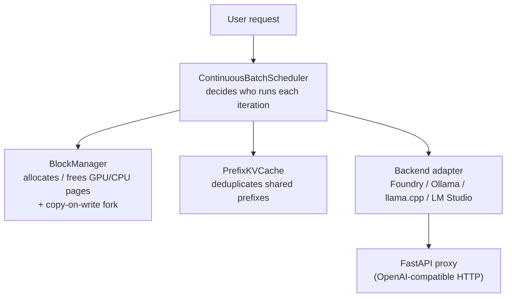

# KVStream Demo Suite

A collection of runnable demonstrations for **KVStream** — a local GPU inference engine implementing PagedAttention, continuous batching and prefix KV-cache deduplication.

---

## Demo map

| # | Script | Requires backend | What it shows |
|---|--------|-----------------|---------------|
| 1 | `01_block_manager.py`    | No  | PagedAttention block allocator — pages, CoW forks, fragmentation |
| 2 | `02_prefix_cache.py`     | No  | Prefix KV cache — shared system prompts, hit/miss, speedup |
| 3 | `03_scheduler.py`        | No  | Continuous batch scheduler — state transitions, preemption |
| 4 | `04_live_inference.py`   | **Yes** | Live streaming inference through the KVStream proxy |
| 5 | `05_memory_efficiency.py`| No  | Paged vs contiguous allocation — VRAM waste visualised |
| 6 | `06_full_pipeline.py`    | No  | All three subsystems wired together end-to-end |

---

## Quick start

### Prerequisites

```powershell
# From the project root — install KVStream and its dependencies
py -3 -m pip install -e .
```

### Run offline demos (no model needed)

```powershell
# Individual demos
py -3 demo/01_block_manager.py
py -3 demo/02_prefix_cache.py
py -3 demo/03_scheduler.py
py -3 demo/05_memory_efficiency.py
py -3 demo/06_full_pipeline.py

# All offline demos at once
py -3 demo/run_all_demos.py

# Pick a specific demo by number
py -3 demo/run_all_demos.py --only 5
```

### Run live inference demo (Demo 4)

Demo 4 sends real requests to the KVStream proxy and prints streaming output with latency metrics.

**Step 1 — Start Foundry Local** (or Ollama)

```powershell
# Foundry Local auto-discovers its port — no config needed
foundrylocal serve

# Load a model (first time only)
foundrylocal run phi-3-mini
```

**Step 2 — Start the KVStream proxy**

```powershell
py -3 -m kvstream serve --backend foundry
```

**Step 3 — Run Demo 4**

```powershell
py -3 demo/04_live_inference.py
# or with Ollama:
py -3 demo/04_live_inference.py --backend ollama --model llama3.2
```

**Expected output for `/health`:**
```json
{
  "status": "ok",
  "backend": "foundry",
  "backend_url": "http://localhost:53453",
  "backend_model": "phi-3-mini",
  "backend_healthy": true
}
```

---

## What each demo teaches

### Demo 1 — Block Manager
PagedAttention stores KV tensors in fixed-size **pages** (default 16 tokens).
Sequences hold a *logical → physical* mapping so their memory can be
scattered across VRAM — no contiguous chunk needed.

Key operations shown:
- `allocate(seq_id, num_tokens)` — reserve pages for a new sequence
- `append_slot(seq_id)` → `(physical_block_id, slot)` — grow as tokens are generated
- `fork(parent, child)` — copy-on-write share for prefix dedup
- `free(seq_id)` — instant return to free-list

### Demo 2 — Prefix KV Cache
When many requests share the same system prompt, KVStream computes the KV
cache once and **forks** it to every new request via copy-on-write.
Only the user-specific suffix needs to be prefilled.

Typical result: **4–6× prefill speedup** for requests with a 48-token system prompt.

### Demo 3 — Continuous Batch Scheduler
KVStream's scheduler makes a *new batching decision every forward pass*:
- New sequences enter mid-decode
- Finished sequences leave immediately (no padding waste)
- Sequences preempted by memory pressure are swapped to CPU and resume when GPU space is free

### Demo 4 — Live Inference
Sends 3 prompts to the running proxy and shows:
- Real-time token streaming (SSE)
- Time-to-first-token (TTFT)
- Tokens/second throughput
- Engine memory and scheduler stats after each request

### Demo 5 — Memory Efficiency
Side-by-side comparison of contiguous vs paged allocation across 8
requests with varying actual completion lengths.  Visualises how
contiguous allocation wastes VRAM proportional to `max_tokens - actual_tokens`.

### Demo 6 — Full Pipeline
All three subsystems (BlockManager + PrefixKVCache + Scheduler) working
together.  12 concurrent requests share a system prompt; the scheduler
keeps the GPU busy throughout with continuous batching.

---

## Architecture recap


